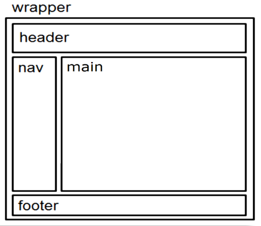
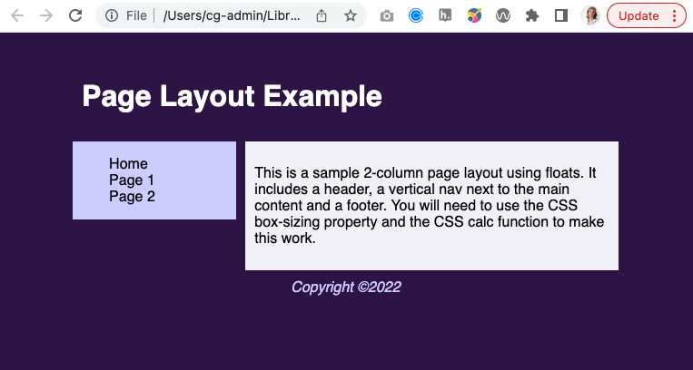

# Page Layout Exercise

Create a 2-column page layout using floats. 

1. Structure the content in index.html following the diagram below:  
 
2. Write the CSS in the external stylesheet to make the HTML look like the image below: 

Tip: You will need to use the CSS box-sizing property and the CSS calc function to make this work.